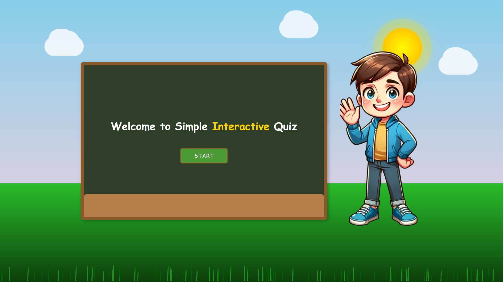

# Interactive Quiz

## Overview
Welcome to the Interactive Quiz application! This project is designed to challenge your knowledge across various topics with an engaging and user-friendly interface. The quiz provides immediate feedback on your answers and keeps track of your score to help you monitor your progress.

## Technologies Used
This project is built using the following technologies:
- **HTML**: For structuring the content.
- **CSS**: For styling the application.
- **JavaScript**: For implementing the interactive features.

## Screenshots
Here are some screenshots of the application:

### Quiz Start

### Quiz Question

### Quiz Result

## Getting Started
To get started with the Interactive Quiz application, follow these steps:
1. Clone the repository to your local machine.
2. Open the `index.html` file in your web browser.
3. Start the quiz and enjoy!

## Contributing
Contributions are welcome! If you have any suggestions or improvements, please feel free to submit a pull request.

## License
This project is licensed under the MIT License. See the [LICENSE](LICENSE) file for more details.
